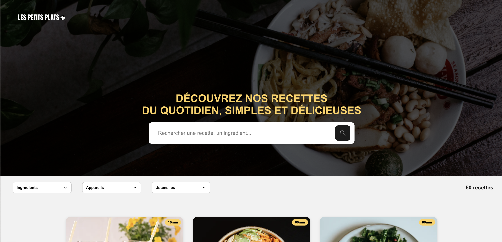

# Les Petits Plats

> Projet 5 - OpenClassrooms - Développeur Front-End

---

## 🌐 Présentation

Ce projet a pour objectif de créer une application web dynamique pour afficher et rechercher des recettes de cuisine.  
Je travaille ici en tant que développeur front-end, sans base de données mais avec des données JSON locales, afin de simuler un moteur de recherche multicritères performant.

Les utilisateurs peuvent consulter les recettes, effectuer une recherche par mots-clés, ou affiner leur recherche à l’aide de filtres comme les **ingrédients**, **ustensiles** ou **appareils**.

---

## 🔗 Démo en ligne

👉 [Voir le site](https://p5-lespetitsplats.netlify.app/)

---

## 🖼️ Aperçu



---

## ⚙️ Architecture du projet

Le projet repose entièrement sur le **framework Next.js** (React 18), sans backend, et avec une gestion dynamique des composants via les hooks (`useState`, `useEffect`, `useMemo`).

### 📁 Dossiers principaux

- `app/components` : composants réutilisables (carte recette, header, footer, dropdowns…)
- `app/data` : contient le fichier `recipes.json` avec les 50 recettes
- `public/images` : toutes les images associées aux recettes
- `app/recette/[slug]` : page dynamique affichant le détail d’une recette

---

## 🛠️ Fonctionnalités principales

### 🔍 Moteur de recherche avancé

- Recherche par mot-clé dans le titre, la description ou les ingrédients.
- Filtres dynamiques (tags) : ingrédients, appareils, ustensiles.
- Actualisation des tags disponibles en fonction des recettes filtrées.
- Système de suppression / ajout de tags sélectionnés.

### 🧩 Composants réactifs

- `SearchBar` : champ de recherche global avec filtre intelligent.
- `FilterDropdown` : listes déroulantes interactives avec recherche interne.
- `RecipeCard` : affichage des recettes avec visuel, temps et contenu.
- `RecipeList` : mise à jour dynamique des recettes affichées.

### 🖼️ Responsive Design

- Interface adaptable aux formats mobile, tablette et desktop.
- Layout global propre et structuré avec typographie Google Fonts.

---

## 🚀 Lancer le projet

1. **Cloner le dépôt** :
   ```bash
   git clone git@github.com:hNnicolas/P5_Lespetitsplats.git
   cd P5_Lespetitsplats

